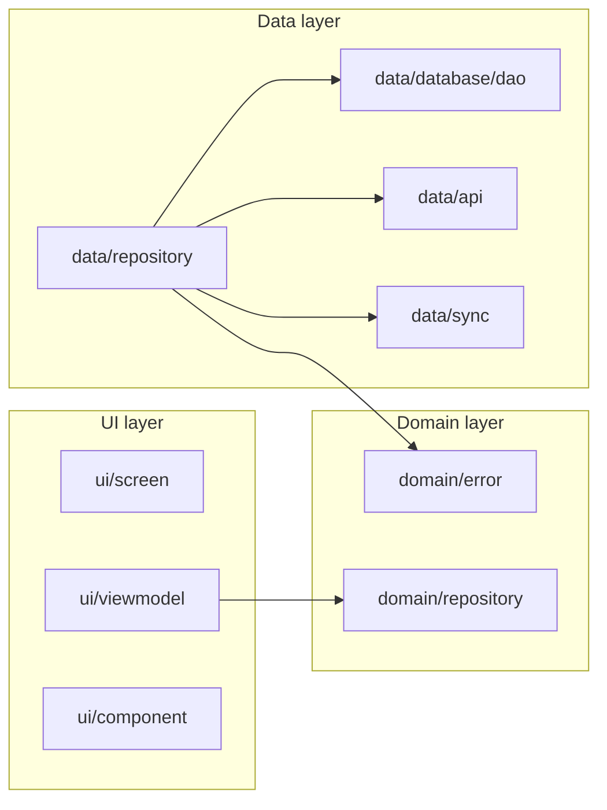

# Flit Android – Agent overview

High-level guide for humans and AI agents working on the Flit Android codebase.

## Architecture

Layered structure: **data** → **domain** → **ui**, with **di** (Hilt) wiring dependencies.

- **UI:** Compose screens (`ui/screen/`), ViewModels (`ui/viewmodel/`), reusable components (`ui/component/`), theme (`ui/theme/`).
- **Domain:** Error types and handling (`domain/error/`), repository interfaces (`domain/repository/`), shared extensions (`domain/ResultExtensions.kt`).
- **Data:** Room DAOs and entities (`data/database/`), REST API client (`data/api/`), sync with backend (`data/sync/`), repository implementations (`data/repository/`).
- **DI:** Hilt modules in `di/`; `ConfigModule`, `NetworkModule`, `RepositoryModule`, `UtilityModule`.

## Main modules

| Path | Purpose |
|------|---------|
| `config/` | AppConfig, AudioConfig, ModelConfig, NetworkConfig; backend URL from BuildConfig. |
| `data/database/` | Room DB, DAOs, entities, PurgeDeletedRunner, NotesearchRebuilder. |
| `data/search/` | SearchNormalizer (stop words, lowercase), NoteSearchScorer (ranked search). Notesearch table: one row per note (note_id, content); content = normalized title+body; row hard-deleted on note soft-delete. |
| `data/api/` | FlitApiService, connect/sync API models. |
| `data/sync/` | SyncScheduler, sync orchestration. |
| `data/repository/` | SettingsRepository, SyncRepository, ExportRepository, etc. |
| `domain/error/` | AppError (sealed hierarchy), ErrorHandler, AppErrorException. |
| `domain/repository/` | Interfaces for AudioRepository, ModelRepository. |
| `ui/screen/` | Composable screens (Home, NoteEdit, Settings, etc.). |
| `ui/component/PrimaryActionButton` | Capped-width primary actions (`MaxPrimaryButtonWidth` in `ui/theme/Dimensions.kt`) so buttons do not stretch edge-to-edge on wide layouts. |
| `ui/viewmodel/` | ViewModels for notes, settings, transcription, model download. |
| `utils/` | AudioTranscriber, VoiceRecorder, SecurityUtils, model loading, HuggingFace downloader. |

## Conventions

- **Error handling:** Use the sealed `AppError` hierarchy and `ErrorHandler.transform()` / `handleThrowable()`. Surface user-facing messages from `AppError.userMessage`; log technical details via `ErrorHandler.logError()`.
- **Dependency injection:** Hilt only. ViewModels are `@HiltViewModel`; repositories and API are provided in `di/` modules.
- **Backend API:** OpenAPI is the source of truth. When implementing or debugging API calls, fetch the spec (e.g. `curl -s http://localhost:8000/openapi.json`) and use paths, methods, and schemas from it. See `.cursor/rules/Backend-API-OpenAPI.mdc`.
- **Release signing:** Use environment variables only (no secrets in repo). Set `RELEASE_STORE_FILE`, `RELEASE_STORE_PASSWORD`, `RELEASE_KEY_ALIAS`, `RELEASE_KEY_PASSWORD` for signed release builds. See README.
- **Sync versioning:** Local content edits to entities (Note, Category, Chunk, Relationship, NoteCategory) must increment the entity's `ver` field so sync detects changes. Use `.copy(..., ver = entity.ver + 1)` at the caller, or a custom `@Query` with `ver = ver + 1`.

## Pointers

- **Backend base URL:** Debug uses `BuildConfig.BACKEND_BASE_URL` (set in `app/build.gradle.kts`); release uses production URL. Override via build type or local config if needed.
- **Testing:** Unit tests in `app/src/test/`; instrumented tests in `app/src/androidTest/`. Use JUnit, coroutines test, and Hilt testing where applicable.
- **Style / static analysis:** `.editorconfig` and Detekt (or ktlint) for consistent style and lint rules.
- **Primary action buttons:** Use `PrimaryActionButton` / `PrimaryActionButtonRow` from `ui/component/` for full-width actions; width is capped at `MaxPrimaryButtonWidth` and centered on tablets.
- **Note search:** Search uses `notesearch` table (normalized content), `NoteSearchScorer` (prefix/substring + fuzzy), and `SearchNormalizer`. Keep notesearch in sync: upsert on note insert/update, `notesearchDao.deleteByNoteId` on note soft-delete. One-time rebuild after DB migration runs at startup via `NotesearchRebuilder`.
