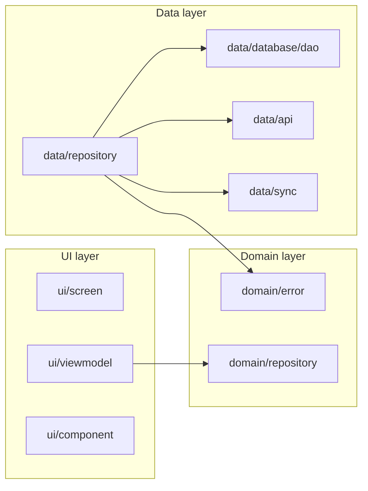

# Flit Android – Agent overview

High-level guide for humans and AI agents working on the Flit Android codebase.

## Architecture

Layered structure: **data** → **domain** → **ui**, with **di** (Hilt) wiring dependencies.

- **UI:** Compose screens (`ui/screen/`), ViewModels (`ui/viewmodel/`), reusable components (`ui/component/`), theme (`ui/theme/`).
- **Domain:** Error types and handling (`domain/error/`), repository interfaces (`domain/repository/`), shared extensions (`domain/ResultExtensions.kt`).
- **Data:** Room DAOs and entities (`data/database/`), REST API client (`data/api/`), sync with backend (`data/sync/`), repository implementations (`data/repository/`).
- **DI:** Hilt modules in `di/`; `ConfigModule`, `NetworkModule`, `RepositoryModule`, `UtilityModule`.

## Main modules

| Path | Purpose |
|------|---------|
| `config/` | AppConfig, AudioConfig, ModelConfig, NetworkConfig; `backendBaseUrl` and `flitCoreWebLoginUrl` from BuildConfig (`BACKEND_BASE_URL`, `FLIT_CORE_WEB_LOGIN_URL`). `PRIVACY_POLICY_URL` (BuildConfig) is opened in the system browser from the overflow menu. |
| `data/database/` | Room DB, DAOs, entities, PurgeDeletedRunner, NotesearchRebuilder. |
| `data/search/` | SearchNormalizer (stop words, lowercase), NoteSearchScorer (ranked search). Notesearch table: one row per note (note_id, content); content = normalized title+body; row hard-deleted on note soft-delete. |
| `data/export/` | Zip export of per-note markdown (`ExportRepository.exportToZip`); merge import from zip (root `.md` only) or single `.md` via SAF. Wikilink keys in filenames; `core_id` never written to files. |
| `data/api/` | FlitApiService, connect/sync API models. |
| `data/sync/` | SyncScheduler, sync orchestration. |
| `data/repository/` | SettingsRepository, SyncRepository, ExportRepository, etc. |
| `domain/error/` | AppError (sealed hierarchy), ErrorHandler, AppErrorException. |
| `domain/repository/` | Interfaces for AudioRepository, ModelRepository. |
| `ui/screen/` | Composable screens (Home, NoteEdit, Settings, etc.). |
| `ui/component/PrimaryActionButton` | Capped-width primary actions (`MaxPrimaryButtonWidth` in `ui/theme/Dimensions.kt`) so buttons do not stretch edge-to-edge on wide layouts. |
| `ui/viewmodel/` | ViewModels for notes, settings, transcription, model download. |
| `utils/` | AudioTranscriber, VoiceRecorder, SecurityUtils, model loading, HuggingFace downloader. |

## Conventions

- **Error handling:** Use the sealed `AppError` hierarchy and `ErrorHandler.transform()` / `handleThrowable()`. Surface user-facing messages from `AppError.userMessage`; log technical details via `ErrorHandler.logError()`.
- **Dependency injection:** Hilt only. ViewModels are `@HiltViewModel`; most repositories are `@Inject` constructors or `@Provides` in `di/` modules (`ExportRepository` is constructor-injected).
- **Backend API:** OpenAPI is the source of truth. When implementing or debugging API calls, fetch the spec (e.g. `curl -s http://localhost:8000/openapi.json`) and use paths, methods, and schemas from it. See `.cursor/rules/Backend-API-OpenAPI.mdc`.
- **Release signing:** Use environment variables only (no secrets in repo). Set `RELEASE_STORE_FILE`, `RELEASE_STORE_PASSWORD`, `RELEASE_KEY_ALIAS`, `RELEASE_KEY_PASSWORD` for signed release builds. See README.
- **Google Play (crash deobfuscation):** Release builds use `isMinifyEnabled = false`, so R8 does not emit `mapping.txt`; there is nothing to upload for Java/Kotlin deobfuscation unless you turn minify on (then upload `app/build/outputs/mapping/release/mapping.txt` for each version). See [native debug symbols](https://developer.android.com/build/include-native-symbols) for NDK uploads.
- **Google Play (native debug symbols):** `app/build.gradle.kts` sets `release { ndk { debugSymbolLevel = "SYMBOL_TABLE" } }`. After `./gradlew :app:bundleRelease`, if AGP extracted symbol tables, upload `app/build/outputs/native-debug-symbols/release/native-debug-symbols.zip` for that app version in Play Console (e.g. Release → App bundle explorer → symbol upload for the artifact). If that zip is missing or empty, merged `.so` files are likely fully stripped (common for prebuilts).
- **Sherpa ONNX JNI:** `libsherpa-onnx-jni.so` is **not** built in this repo. Build it from [k2-fsa/sherpa-onnx](https://github.com/k2-fsa/sherpa-onnx) (e.g. Android scripts under that repo) and copy the `arm64-v8a` library into `app/src/main/jniLibs/arm64-v8a/` (often gitignored). Pin the sherpa-onnx **tag or commit** per release; keep unstripped `.so` or split debug symbols from the **same** build and upload them to Play separately if you need full native stacks inside sherpa. To see what the release merge contains: `app/build/intermediates/merged_native_libs/release/mergeReleaseNativeLibs/out/lib/arm64-v8a/` after a release build.
- **ONNX Runtime JNI:** Version comes from `gradle/libs.versions.toml` (`onnxruntime-android`). Crashes inside `libonnxruntime.so` / `libonnxruntime4j_jni.so` need symbols from Microsoft for that exact ORT version if they publish them; otherwise stacks may stay partially obfuscated.
- **Sync versioning:** Local content edits to entities (Note, Category, Relationship, NoteCategory) must increment the entity's `ver` field so sync detects changes. Use `.copy(..., ver = entity.ver + 1)` at the caller, or a custom `@Query` with `ver = ver + 1`.
- **Chunking deprecation:** Chunk table/API sync has been removed. Do not reintroduce `ChunkEntity`/`ChunkDao` or chunk compare/get/push endpoints without an explicit migration and backend contract update.
- **Compose list performance:** Always provide stable keys for `LazyColumn.items(...)` rows, keep expensive rendering (for example markdown parsing) out of list items when possible, and hoist shared `StateFlow` collection to the highest practical parent composable.

## Pointers

- **Theme (first launch):** In-app preference defaults to system (`SettingsRepository` / `ThemeMode.SYSTEM`). The activity `Theme.Flit` parents `Theme.DeviceDefault.DayNight` with `windowActionBar` false / `windowNoTitle` true so the window follows system light/dark before Compose applies `FlitTheme`, without a duplicate system ActionBar above the Compose top app bar (platform `*NoActionBar` parents are not reliably linkable via AAPT here).
- **Home + system back:** On the home route, the first back press shows a snackbar (“Press back again to exit”) for ~2s; a second back within that window finishes the activity.
- **Privacy policy:** Overflow menu → Privacy Policy opens `BuildConfig.PRIVACY_POLICY_URL` in the default browser (no in-app WebView).
- **Bottom bar (no model):** When `ModelSize.NONE`, the trailing control shows the send icon and submits typed text (same as the focused submit path), and does not request the microphone until a model is selected.
- **Backend base URL:** Debug uses `BuildConfig.BACKEND_BASE_URL` (set in `app/build.gradle.kts`); release uses production URL. Override via build type or local config if needed.
- **Testing:** Unit tests in `app/src/test/`; instrumented tests in `app/src/androidTest/`. Use JUnit, coroutines test, and Hilt testing where applicable.
- **Style / static analysis:** `.editorconfig` and Detekt (or ktlint) for consistent style and lint rules.
- **Primary action buttons:** Use `PrimaryActionButton` / `PrimaryActionButtonRow` from `ui/component/` for full-width actions; width is capped at `MaxPrimaryButtonWidth` and centered on tablets.
- **Note search:** Search uses `notesearch` table (normalized content), `NoteSearchScorer` (prefix/substring + fuzzy), and `SearchNormalizer`. Keep notesearch in sync: upsert on note insert/update, `notesearchDao.deleteByNoteId` on note soft-delete. One-time rebuild after DB migration runs at startup via `NotesearchRebuilder`.
- **Onboarding + welcome note:** `AppConfig.ONBOARDING_REVISION` gates onboarding display (`SettingsRepository.shouldShowOnboarding`). The welcome note is sourced from `res/raw/welcome_note.md` and seeded as note id `0` only once at install-time when the notes table is empty; it is never auto-recreated later if missing.
